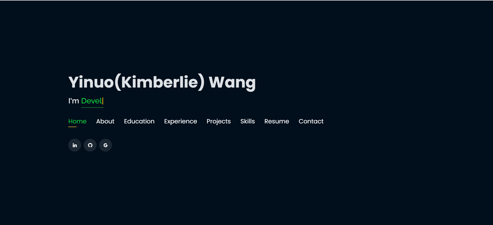
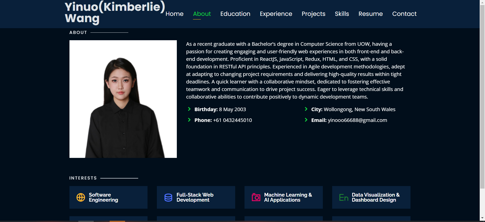
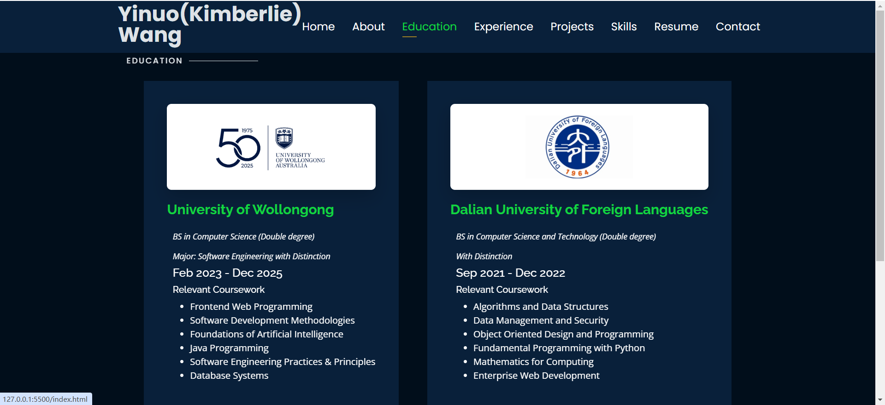
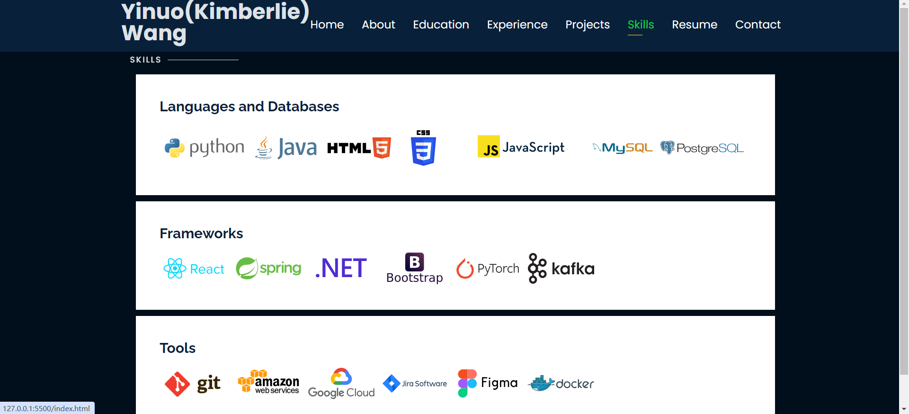
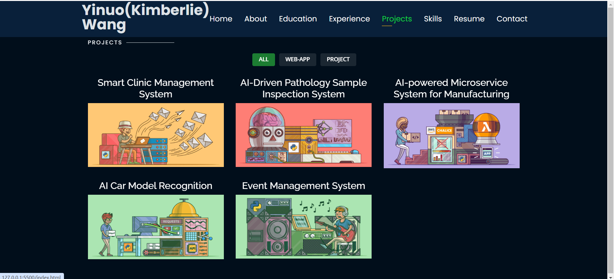
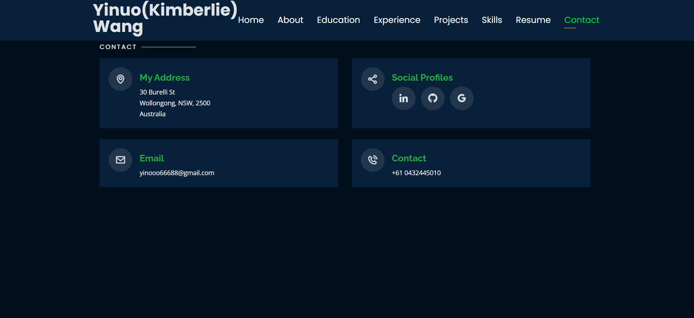

# Personal Portfolio 🔥
> https://github.com/yino-Wang/yino-portfolio.git

### Website Preview
#### Home Page

#### About Page

#### Education Page

#### Skills Page

#### Projects Page

  
#### Contact Page

## Features 📋
⚡️ Fully Responsive\
⚡️ Valid HTML5 & CSS3\
⚡️ Typing animation using `Typed.js`\
⚡️ Easy to modify

## Sections 📚
✔️ About\
✔️ Interests\
✔️ Education\
✔️ Online Certification\
✔️ Experience\
✔️ Projects \
✔️ Skills \
✔️ Resume\
✔️ Contact Info

## Tools Used 🛠️
* <b>GitHub Pages</b> - To host my static website (HTML, CSS, JS).

Author Yino
